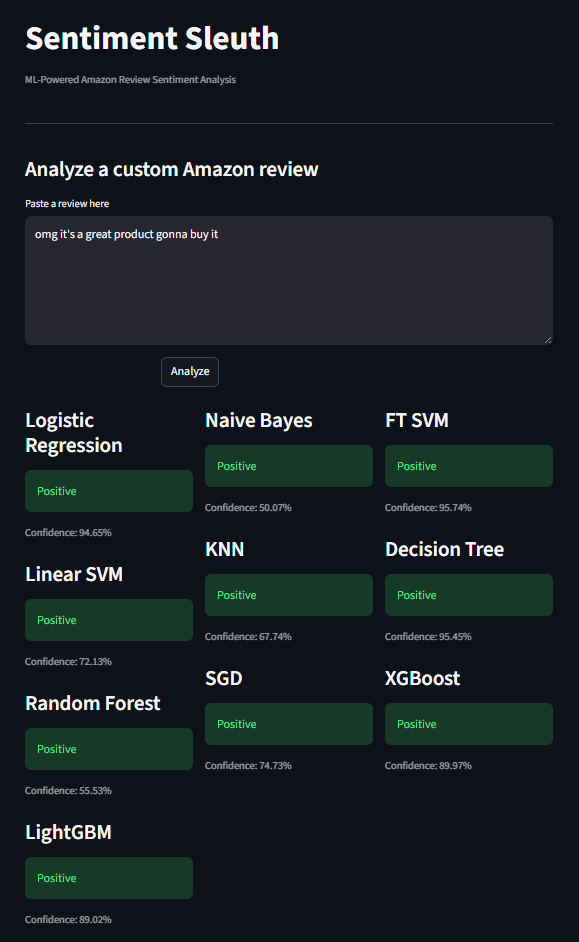
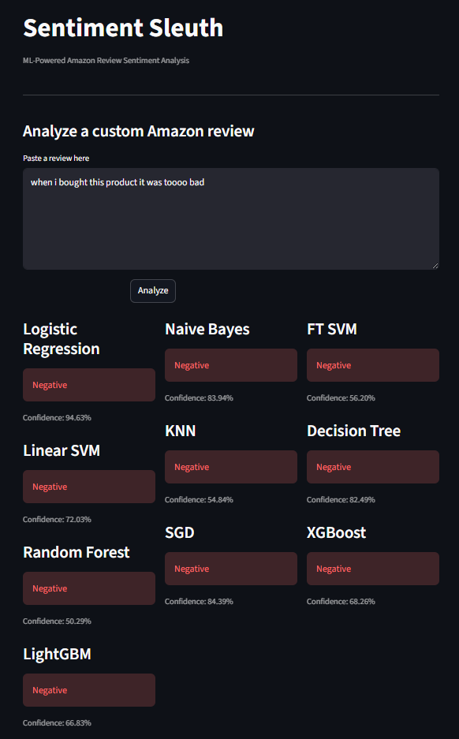

# Sentiment Sleuth

[](https://github.com/elsayedelmandoh/sentiment-sleuth)
[](https://elsayedelmandoh-sentiment-sleuth.hf.space)

<p align="center">
  
  &nbsp; &nbsp;
  
</p>

## Table of Contents
- [Overview](#overview)
- [Key Features](#key-features)
- [Setup](#setup)
	- [0. Prerequisites](#0-prerequisites)
	- [1. Clone the Repository](#1-clone-the-repository)
	- [2. Create Conda Environment](#2-create-conda-environment)
	- [3. Environment Variables](#3-environment-variables)
- [Usage](#usage)
- [Contributing](#contributing)
- [Author](#author)


## Overview
ًThis is a project for performing sentiment analysis on Amazon product reviews using classical machine-learning models. The project includes data processing and feature engineering notebooks, multiple trained classifiers saved as joblib artifacts, a TF-IDF vectorizer, and a Streamlit UI to analyze custom review text.

Key components in the repository:
- Interactive app: `app.py` (Streamlit)
- Saved models: `data/models/*.joblib`
- Vectorizer and precomputed TF-IDF sparse matrices: `data/vectorizers/`
- Processed datasets and samples: `data/processed/` and `data/samples/`
- Notebooks: `notebooks/` (EDA, preprocessing, feature engineering, and model notebooks)
- Documentation: `docs/` (research notes, project definition, workflow, and report)

The Streamlit app loads saved artifacts via `src.utils.helpers` and exposes multiple classifiers (`Logistic Regression, Naive Bayes, SVM variants, KNN, Decision Trees, Random Forest, SGD, XGBoost and LightGBM`) so you can compare predictions and confidence scores side-by-side.


## Key Features
* **Multiple Models:** Compare results from several traditional classifiers (Logistic Regression, Naive Bayes, SVMs, KNN, Decision Trees, Random Forests, SGD, XGBoost, LightGBM).
* **Reusable Artifacts:** TF-IDF vectorizer and trained models are persisted under `data/vectorizers/` and `data/models/` for fast local inference.
* **Notebooks for Reproducibility:** Step-by-step Jupyter notebooks for data acquisition, EDA, preprocessing, feature engineering and model training are included under `notebooks/`.


## Setup
0. Prerequisites
Before running this project, ensure you have the following installed:
* [Git](https://git-scm.com/)
* [Anaconda](https://www.anaconda.com/) or Miniconda
* Python 3.12 (recommended)

1. Clone the Repository
```bash
git clone https://github.com/elsayedelmandoh/sentiment-sleuth
cd sentiment-sleuth
```
2. Create Conda Environment
```bash
# Create & activate the environment
conda create -n envname python=3.12 -y
conda activate envname

# Install pip and project dependencies
conda install pip -y
pip install -r requirements.txt
```

3. Environment Variables
Create a `.env` file at the project root and add any necessary API keys or configuration variables

HF Hub runtime download (recommended for Spaces)
-----------------------------------------------
To avoid committing large model artifacts to the repository, you can host them on the Hugging Face Hub and let the Streamlit app download them at runtime. Set the following environment variable in your `.env` or in the Space settings:

- `HF_ASSETS_REPO`: The Hugging Face repository id (e.g. `username/repo-name`) that contains the artifact files.
- `HF_ASSETS_REPO_TYPE` (optional): Use `dataset` if your assets were uploaded as a dataset rather than a model/repo.

The app will attempt to load local files from `data/models/` and `data/vectorizers/` first. If a file is missing and `HF_ASSETS_REPO` is set and `huggingface_hub` is installed, the app will download the missing file into `data/remote_cache/` and then load it from there. This keeps your Git repository small and lets Hugging Face host large binaries.

Example `.env` entries:

```env
HF_ASSETS_REPO=your-username/sentiment-artifacts
HF_ASSETS_REPO_TYPE=dataset  # optional
```

Advanced runtime configuration
-----------------------------
You can control which files the app attempts to load and where downloaded assets are cached using these optional environment variables:

- `HF_ASSET_FILES` — optional comma-separated list of asset paths (relative to repo). If set, this list overrides the built-in default asset filenames. Example:

```env
HF_ASSET_FILES=data/models/10_random_forest_classifier.joblib,data/vectorizers/tfidf_vectorizer.joblib
```

- `ASSET_CACHE_DIR` — optional path where downloaded artifacts are cached. Default: `data/remote_cache`.

Example `.env` with overrides:

```env
HF_ASSETS_REPO=your-username/sentiment-artifacts
HF_ASSET_FILES=data/models/10_random_forest_classifier.joblib,data/vectorizers/tfidf_vectorizer.joblib
ASSET_CACHE_DIR=data/remote_cache
```

Behavior summary:
- The app uses the asset list from `settings` (defaults are provided). If `HF_ASSET_FILES` is set in the environment it becomes the active list.
- When an asset is missing locally and `HF_ASSETS_REPO` is set, the app will download it into `ASSET_CACHE_DIR` and then load from the cache.


To upload artifacts to the Hub, you can use the `huggingface_hub` CLI or Python API. Example (Python):

```python
from huggingface_hub import Repository, HfApi
api = HfApi()
# create repo and upload files, or use `hf` CLI commands
```

Note: If you run the app locally without setting `HF_ASSETS_REPO`, ensure the `data/models/` and `data/vectorizers/` files exist locally.


## Usage
This project uses Streamlit for the interactive UI. Start the app locally with one of the following commands:

```bash
# Run via Streamlit
streamlit run app.py
```

When the app starts, open the local URL printed in your terminal (usually http://localhost:8501) and paste an Amazon review into the text area to see per-model sentiment predictions and confidence scores.

Model artifacts and vectorizers are loaded from `data/models/` and `data/vectorizers/`. If the vectorizer or model files are missing, the app will show an error message pointing to the expected files.

Reproducibility & Notebooks:   
The `notebooks/` directory contains step-by-step analysis and model training notebooks. Key notebooks:
- `01_data_acquisition.ipynb` — dataset loading and brief description
- `02_eda.ipynb` — exploratory data analysis
- `03_data_preprocessing.ipynb` — cleaning and preprocessing
- `04_feature_engineering.ipynb` — TF-IDF vectorization and feature prep
- `05_logistic_regression.ipynb` through `13_lightgbm.ipynb` — one notebook per model
- `14_comparsion.ipynb` — model comparison and summary

Use these notebooks to retrain or refine models and regenerate the `joblib` artifacts saved in `data/models/`.


## Contributing
Contributions are welcome! If you'd like to improve this project, please follow these steps:
1. Fork the repository.
2. Create a branch for your feature or bug fix (`git checkout -b feature/my-new-feature`).
3. Commit your changes with clear messages (`git commit -m 'add some feature'`).
4. Push to your fork (`git push origin feature/my-new-feature`).
5. Open a pull request.

Please include reproducible steps and, if applicable, updated notebooks or scripts to regenerate models.

## Author
Elsayed Elmandoh - NLP Engineer  
* Connect on LinkedIn & X [Linktree](https://linktr.ee/elsayedelmandoh)

Mohamed Kamal - AI Engineer
* Connect on [LinkedIn](https://www.linkedin.com/in/mohamed-kamal-has/?utm_source=share_via&utm_content=profile&utm_medium=member_android)

Mahmoud Magdy - Information Security Engineer
* Connect on [LinkedIn](https://www.linkedin.com/in/mahmoud-magdy-raouf-8b62003a7/)